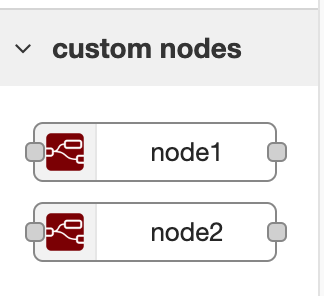

# custom-node-red-node-es-template



## 📁 Directory Structure

```bash
node-red-node-es-template/
└── src/
    └── nodes/
        ├── node-1/
        │   ├── client/
        │   │   ├── i18n/
        │   │   │   ├── dictionaries/
        │   │   │   │   ├── de.json
        │   │   │   │   └── en-US.json
        │   │   │   └── docs/
        │   │   │       ├── de.html
        │   │   │       └── en-US.html
        │   │   ├── icons/
        │   │   │   └── icon-1.png
        │   │   ├── index.html
        │   │   └── index.js
        │   └── server/
        │       └── index.js
        └── node-2/
            ├── client/
            │   ├── i18n/
            │   │   ├── dictionaries/
            │   │   │   ├── de.json
            │   │   │   └── en-US.json
            │   │   └── docs/
            │   │       ├── de.html
            │   │       └── en-US.html
            │   ├── icons/
            │   │   └── icon-2.png
            │   ├── index.html
            │   └── index.js
            └── server/
                └── index.js
```

### dist

```bash
node-red-node-es-template/
└── dist/
    ├── icons/
    │   ├── icon-1.png
    │   └── icon-2.png
    ├── locales/
    │   ├── de/
    │   │   ├── index.html
    │   │   └── index.json
    │   └── en-US/
    │       ├── index.html
    │       └── index.json
    ├── index.html
    ├── index.js.map
    └── index.js
```

## 💻 Dev Environment Requirements

| Tool           | Version |
| -------------- | ------- |
| node           | >= 18   |
| npm            | >= 10   |
| docker         | >= 26   |
| docker compose | >= 2    |

## 📖 How to test your node

1. open a terminal in the root of this project
2. run `npm install`
3. run `npm run docker:compose:up`
4. open your browser
5. navigate to `http://localhost:1880`
6. verify that these nodes are available in the pallete
